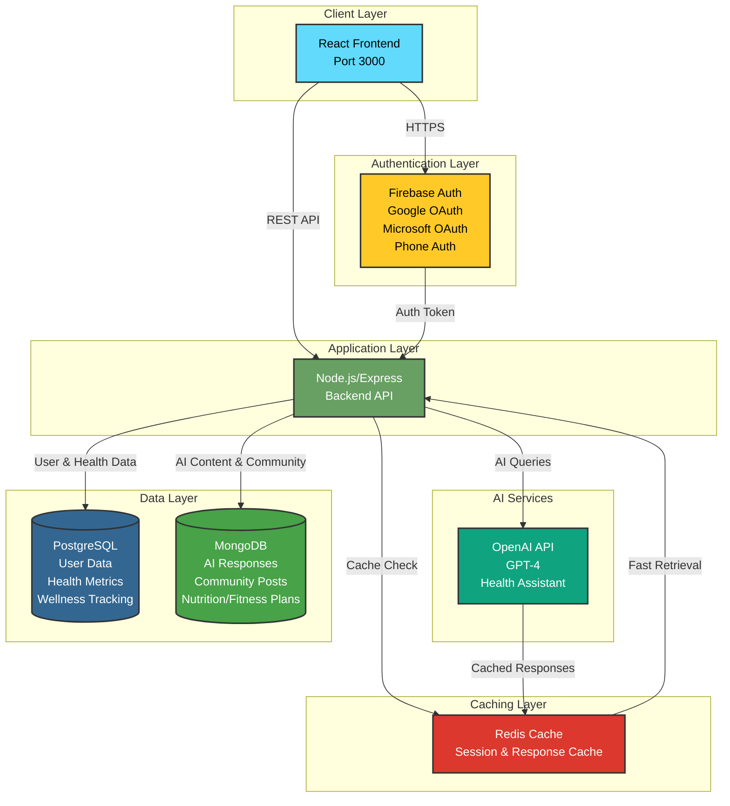
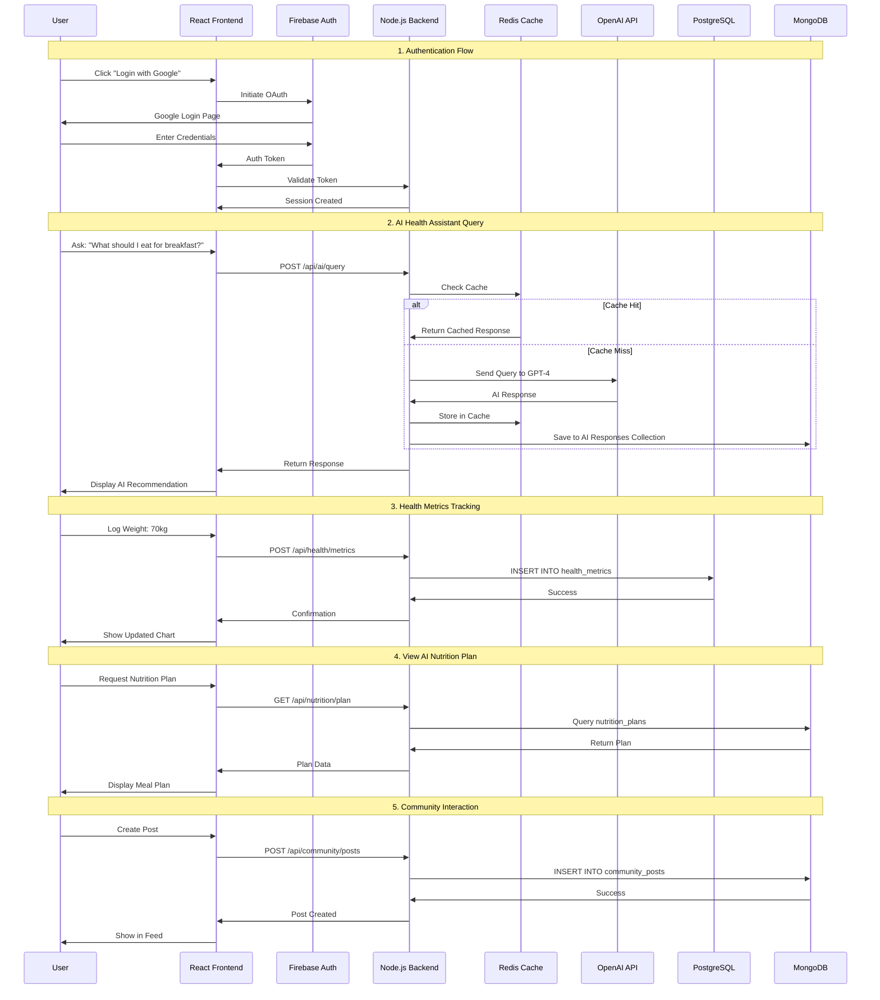
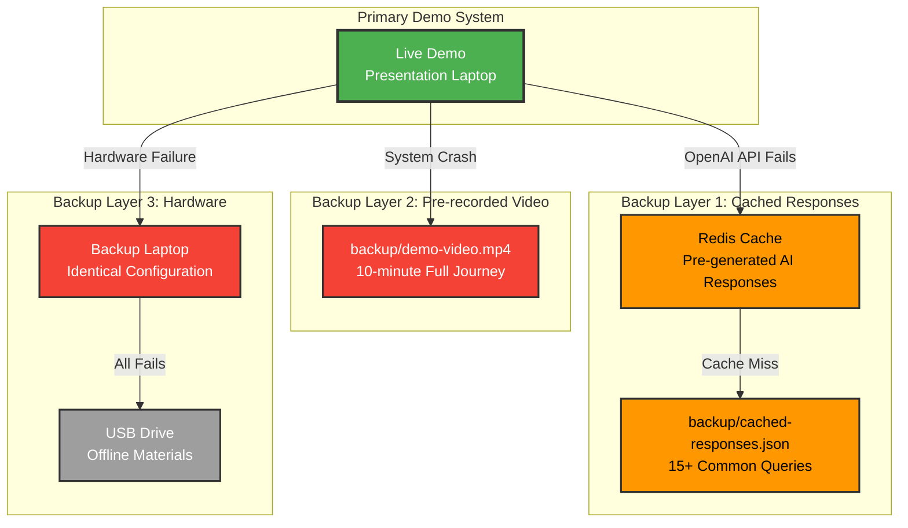

# WellSense AI Platform - Technical Architecture Diagrams

## Diagram 1: System Architecture

This diagram shows all the major components of the WellSense AI Platform and how they connect.



### Component Details:

- **React Frontend**: Single-page application providing user interface
- **Firebase Auth**: Handles authentication via Google OAuth, Microsoft OAuth, and phone authentication
- **Node.js/Express Backend**: RESTful API server managing business logic
- **OpenAI API**: GPT-4 powered AI health assistant for personalized recommendations
- **Redis Cache**: High-speed caching for sessions and AI responses
- **PostgreSQL**: Relational database for structured data (users, health metrics, wellness tracking)
- **MongoDB**: Document database for flexible data (AI responses, community posts, nutrition/fitness plans)

---

## Diagram 2: Data Flow - User Journey

This diagram shows how data flows through the system during a typical user journey.



### Data Flow Stages:

1. **Authentication**: User authenticates via Firebase, backend validates token and creates session
2. **AI Interaction**: User queries AI assistant, system checks cache first, then calls OpenAI if needed
3. **Health Tracking**: User logs health metrics, stored in PostgreSQL for structured time-series data
4. **AI Recommendations**: User views nutrition/fitness plans retrieved from MongoDB
5. **Community**: User creates posts stored in MongoDB for flexible content structure

---

## Diagram 3: Demo Day Backup System Architecture

This diagram shows the backup and fallback mechanisms for demo day reliability.



### Backup Strategy:

- **Layer 1**: Cached responses in Redis and JSON file for instant AI fallback
- **Layer 2**: Pre-recorded demo video for complete system failure
- **Layer 3**: Backup laptop and USB drive for hardware failures

---

## Converting to Images for Slides

### Option 1: Using Mermaid Live Editor
1. Visit https://mermaid.live/
2. Copy each diagram code block
3. Paste into the editor
4. Click "Download PNG" or "Download SVG"
5. Insert images into PowerPoint/Google Slides

### Option 2: Using VS Code Extension
1. Install "Markdown Preview Mermaid Support" extension
2. Open this file in VS Code
3. Right-click on diagram → "Copy Mermaid Diagram"
4. Paste into presentation software

### Option 3: Using Command Line (requires mmdc)
```bash
npm install -g @mermaid-js/mermaid-cli
mmdc -i docs/architecture-diagrams.md -o docs/system-architecture.png
mmdc -i docs/architecture-diagrams.md -o docs/data-flow.png
mmdc -i docs/architecture-diagrams.md -o docs/backup-system.png
```

### Recommended Slide Layout

**Slide 1: System Architecture (2 minutes)**
- Title: "WellSense AI Platform - Technical Architecture"
- Include Diagram 1 (System Architecture)
- Bullet points:
  - React frontend for responsive UI
  - Firebase for secure authentication
  - Node.js backend with RESTful API
  - OpenAI GPT-4 for AI health assistant
  - PostgreSQL for structured health data
  - MongoDB for flexible AI content
  - Redis for high-performance caching

**Slide 2: Data Flow & Reliability (2 minutes)**
- Title: "Data Flow & Demo Day Reliability"
- Include Diagram 2 (Data Flow) on left side
- Include Diagram 3 (Backup System) on right side
- Bullet points:
  - End-to-end user journey in under 5 minutes
  - Multi-layer backup system for 99.9% reliability
  - Cached AI responses for instant fallback
  - Pre-recorded video for emergency scenarios

---

## ASCII Art Versions (for text-based presentations)

### System Architecture (ASCII)

```
┌─────────────────────────────────────────────────────────────────┐
│                    WellSense AI Platform                        │
└─────────────────────────────────────────────────────────────────┘

┌──────────────────┐
│  React Frontend  │  ← User Interface (Port 3000)
│   (Port 3000)    │
└────────┬─────────┘
         │
         ├─────────────────┐
         │                 │
         ▼                 ▼
┌─────────────────┐  ┌──────────────────┐
│  Firebase Auth  │  │ Node.js Backend  │
│  - Google OAuth │  │   (Express API)  │
│  - MS OAuth     │  └────────┬─────────┘
│  - Phone Auth   │           │
└─────────────────┘           │
                              ├──────────────┬──────────────┬──────────────┐
                              │              │              │              │
                              ▼              ▼              ▼              ▼
                     ┌──────────────┐ ┌───────────┐ ┌────────────┐ ┌────────────┐
                     │  OpenAI API  │ │   Redis   │ │ PostgreSQL │ │  MongoDB   │
                     │    (GPT-4)   │ │   Cache   │ │  - Users   │ │ - AI Data  │
                     │   AI Health  │ │ - Session │ │  - Metrics │ │ - Posts    │
                     │   Assistant  │ │ - AI Cache│ │  - Wellness│ │ - Plans    │
                     └──────────────┘ └───────────┘ └────────────┘ └────────────┘
```

### Data Flow (ASCII)

```
USER JOURNEY: Authentication → AI Query → Health Tracking → Community

1. AUTHENTICATION
   User → React → Firebase → Node.js → Session Created

2. AI HEALTH ASSISTANT
   User Query → React → Node.js → Check Redis Cache
                                   ├─ Cache Hit → Return Cached
                                   └─ Cache Miss → OpenAI API → Cache → MongoDB

3. HEALTH METRICS
   User Input → React → Node.js → PostgreSQL → Visualization

4. AI RECOMMENDATIONS
   User Request → React → Node.js → MongoDB → Display Plan

5. COMMUNITY
   User Post → React → Node.js → MongoDB → Feed Update
```

---

## Technical Specifications

### Technology Stack Summary

| Layer | Technology | Purpose |
|-------|-----------|---------|
| Frontend | React | Single-page application, responsive UI |
| Authentication | Firebase | Google/Microsoft OAuth, phone auth |
| Backend | Node.js + Express | RESTful API, business logic |
| AI | OpenAI GPT-4 | Health assistant, personalized recommendations |
| Cache | Redis | Session management, AI response caching |
| Database (Relational) | PostgreSQL | Users, health metrics, wellness tracking |
| Database (Document) | MongoDB | AI responses, community posts, nutrition/fitness plans |

### Port Configuration
- Frontend: Port 3000
- Backend API: Port 5000 (proxied through frontend)
- PostgreSQL: Port 5432
- MongoDB: Port 27017
- Redis: Port 6379

### Data Storage Strategy
- **PostgreSQL**: Structured, relational data requiring ACID compliance
- **MongoDB**: Flexible, document-based data with varying schemas
- **Redis**: Temporary, high-speed data requiring sub-millisecond access
